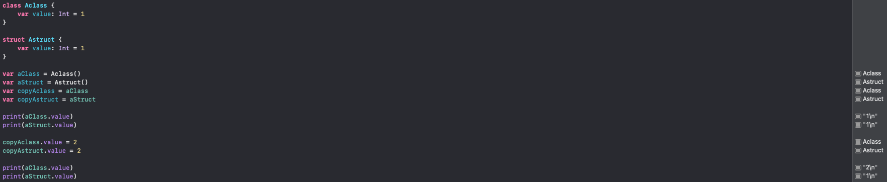
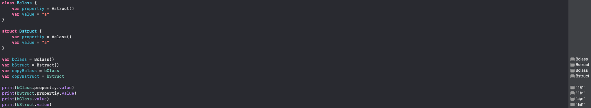
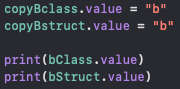
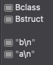
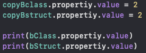
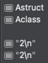
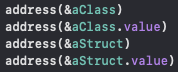

# Class는 ReferenceType / Strcut는 ValueType
기본적으로 class는 참조타입 struct는 값타입으로 알고있다. 그에 따라 참조타입의 데이터는 메모리 영역 중 힙에 저장되고 값타입의 데이터는 스택에 저장된다고 알고 있다. 하지만 실질적으로 어떻게 저장이되는지, 어떤 과정(?)으로 저장되는지 보다 디테일한 차이를 알고 싶었다. 통상적으로 데이터 모델을 만들때 struct를 사용하는데 단순히 습관처럼 class 대신에 struct를 사용하는 느낌을 받아서 적절한 사용예시까지는 아니더라도 조금 더 명확하게 선택 이유를 가지고 개발을 해야겠다는 생각에서 시작된 고민이었다.

# Class 안의 Struct / Struct 안의 Class
Class와 Struct의 차이점은 데이터를 복사해보면 쉽게 알 수 있다. Class의 경우에는 참조타입이므로 데이터가 복사된다해도 데이터 자체를 복사하는 것이 아니라 데이터의 주소값을 저장한다. 그러므로 복사된 데이터가 변경이되면 원본데이터도 변경이 되기 때문에 원본 데이터의 불변을 보장할 수 없다. <br>
하지만 Struct의 경우에는 값타입이므로 데이터가 복사될때 해당 데이터 자체를 복사한다. 그러므로 복사된 데이터가 변경이되면 복사된 데이터만 변경될 뿐 원본데이터는 그대로 유지가된다.


### 그렇다면 Class나 Struct안에 서로 다른 타입을 프로퍼티로 가지고 있을때는?
만약 Class안에 프로퍼티로 Struct를 가지고 있을때 그 Struct에 변경사항이 생긴다면 원본데이터가 변할까 변하지 않을까? <br>
반대로 Struct안에 프로퍼티로 Class를 가지고 있을때 그 Class에 변경사항이 생긴다면? <br>
차근 차근 데이터를 출혁해보면서 차이점을 찾아보자.

<div style="text-align: center;">
    
</div>

일단 위와 동일하게 Class와 Struct의 인스턴스를 하나씩 생성하고 프로퍼티들을 출혁해보았다. 아직은 데이터의 변경이 없으므로 원본 데이터와 동일한 값이 출력되는 것을 볼 수 있다. <br>
먼저 복사된 데이터에서 Class나 Struct가 아닌 인스턴스 내부의 프로퍼티부터 변경을 하고 출력해보자.

<div style="display: flex; justify-content: space-around;">
    

</div>

첫번째 예시와 동일하게 Class는 복사된 데이터를 변경했을때 원본데이터 역시 변경되었고, Struct는 복사된 데이터를 변경하여도 원본데이터는 변경되지 않은 것을 확인할 수 있었다. <br>
그렇다면 Class 내부의 Struct 프로퍼티와 Struct 안의 Class 프로퍼티를 변경할때는 어떻게 될까?

<div style="display: flex; justify-content: space-around;">
    

</div>

Class안의 Struct와 Struct안의 Class 모두 변경된 것을 볼 수 있다. 단순히 구조만 봤을때는 가장 부모가 Class일때는 부모를 따라서 참조타입으로, 가장 부모가 Struct일때는 부모를 따라서 값타입으로 동작한다고 생각했었다. 하지만 막상 데이터를 직접 출력해보니 그게 아니었다.

### 정리를 해보자면
가장 부모가 Class일때는 모든 프로퍼티가 참조타입으로 동작한다. 하지만 Struct일 경우에는 내부 프로퍼티가 값타입이라면 값타입으로, 참조타입이면 참조타입으로 동작한다. 즉, Struct일 경우는 내부 프로퍼티의 타입에 따라서 동작한다는 것 이다.

### 엥? 그러면 실질적으로 메모리에서 어떻게 저장되고 있는 것 일까?
Class와 Struct로 선언한 변수 자체와 변수의 데이터 주소값을 각각 출력해 보았다. 여기서 하나의 의문이 생겼다.
<div style="display: flex; justify-content: space-around;">
    

</div>
결과를 보면 저장되는 메모리가 Stack인지 Heap인지 정확히 판단할 수는 없지만 내 생각엔 Class는 Heap 영역에 저장되므로 Class와 Class.value의 위치가 비슷하고 동떨어진 곳에 Struct와 Struct.value가 비슷한 위치로 출력되어야 했다. 하지만 Class 변수와 Struct 변수, Struct 변수의 데이터가 비슷한 위치에 저장이되고 Class 변수의 데이터만 다른 위치에 저장되고 있었다. <br>
출력 결과만 봐서는 Class 변수가 예상과 다르게 Stack 영역에 저장되고 있는 듯 했지만 집약된 메모리 주소로만 메모리 영역을 판단하기에는 위험성이 있으므로 여기 저기를 찾아보며 그 이유를 알게되었다. <br> 
Class의 경우 메모리의 Stack영역에 데이터에 대한 참조값을 저장한다. 즉, 주소값은 Stack에 실질적인 데이터는 Heap에 저장하는 것 이다. Struct의 경우에는 주소값이 아닌 직접적인 데이터를 Stack 영역에 저장한다. <br>

## 총정리
예시로 정리를 해보자. <br>
### Class 안에 Struct 타입의 프로퍼티와 String 타입의 프로퍼티가 있는 경우

``` swift
class TestClass {
	var property1 = aStruct()
	var property2 = "a"
}

var testClass = TestClass()
```
testClass 변수 자체는 메모리의 Stack 영역에 저장된다. 다만 이때 Stack영역에 testClass 데이터에 대한 참조값(주소값)만 저장이 되고 Heap 영역에 실질적인 property1과 property2의 데이터가 저장된다. <br>
Stack - testClass 변수(참조값만 가지고 있음)
Heap - testClass의 실질적인 데이터(프로퍼티)

### Struct 안에 Class 타입의 프로퍼티와 String 타입의 프로퍼티가 있는 경우

``` swift
struct TestStruct {
	var property1 = aClass()
	var property2 = "a"
}

var testStruct = TestStruct()
```
testStruct 변수는 변수 자체와 데이터 자체가 Stack에 저장된다. 하지만 property1은 Class타입 즉, referenceType이므로 데이터에 대한 참조값(주소값)만 Stack에 저장되고 property1의 실질적인 데이터는 Heap 영역에 저장된다.
Stack - testStruct 변수(referenceType을 제외한 실질 적인 데이터), referenceType 프로퍼티의 참조값(주소값)
Heap - property1에 대한 실질적인 데이터